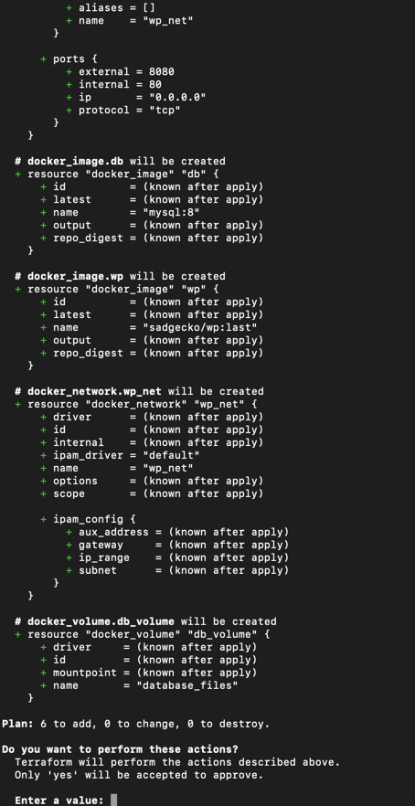
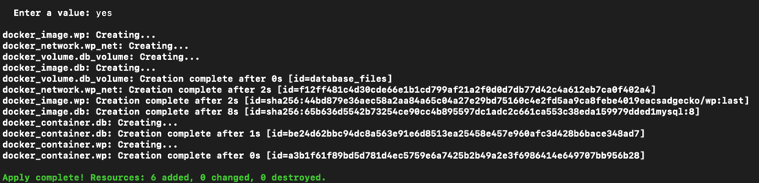

Командою terraform init ініціалізовано terraform та встановлено провайдер.

Створено файл main.tf в якому описано конфігурацію та звʼязок контейнерів docker.

Командою terraform apply було примінено конфігурацію terraform.

